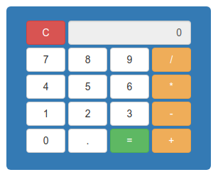

  </img>

# javascript-calculadora

Calculadora com operações matemáticas simples, desenvolvida com o processo BDD (Behavior Driven Development).

- [Aprenda Testes Unitários com JavaScript (Udemy)](https://www.udemy.com/course/aprenda-testes-unitarios-com-jasmine-javascript/)

- [Certificado de Conclusão](https://www.udemy.com/certificate/UC-b83398d0-9c5e-44bd-b75c-d368b367230a/)

---

## Techs

- Frontend:

  - [Bootstrap 3.4.1](https://getbootstrap.com/docs/3.4/getting-started/) (Frontend Library)

- Testes:

  - [Jasmine](https://jasmine.github.io/) (Framework de Testes JavaScript)
  - [Karma](https://karma-runner.github.io/5.0/index.html) (Executor de Testes JavaScript)
  - [Browserify](http://browserify.org/) (Implementa módulos Node JS no lado do cliente)

- Servidor:

  - [http-server](https://www.npmjs.com/package/http-server) (Servidor HTTP local)

---

## Como instalar e usar a aplicação

Clone o repositório na pasta que desejar com o comando:

`git clone https://github.com/rafamatoso/javascript-calculadora.git`

Entre na pasta raiz da aplicacão:

`cd javascript-calculadora`

Instale as dependências da aplicação:

`npm install`

Execute a aplicação com:

`npm start`

E acesse [localhost:8080](http://localhost:8080)
